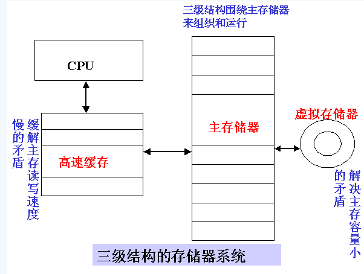

## 基本概念

**数据总线**：是计算机中各组成部件之间进行数据传输时的公共通道。“内数据总线宽度”是指CPU芯片内部数据传送的宽度；“外数据总线宽度”是指CPU与外部数据交换时的数据宽度。

**地址总线**：是載对存储器或I/O端口进行访问时，传送由CPU提供的要访问的存储单元或I/O端口的地址信息的总线，其宽度决定了处理器能直接访问的主存容量的大小。

现在的微型计算机系统采用下图的三级存储器组织结构，即缓冲存储器Cache、主存、和外存。高速缓冲存储器Cache的使用，大大减少了CPU读取指令和操作数所需的时间，使CPU的执行速度显著提高。

>在硬件工程师和普通用户看来，内存就是固化在主板上的内存条，但在应用程序员眼中，并不关心主板上内存条的容量，而是他们可以使用的内存空间，而对于OS开发者来说，则是介于二者之间，既需要知道物理内存的细节，也要为应用程序员提供一个内存空间。逻辑地址、线性地址和物理地址是计算机原理中很重要的三个概念。这三者密切联系又有本质不同。从逻辑地址到物理地址经过了这样的变换：逻辑地址->分段->线性地址->分页->物理地址。

## 逻辑地址

逻辑地址（Logic Address）是指由程序产生的与段相关的偏移地址部分。比如，在C程序中，可以使用&操作读取指针变量本身的值，实际上这个值就是逻辑地址。它是相对于你当前进程数据段的地址，和绝对物理地址不相干。只有在intel实模式下，逻辑地址才等同于物理地址。应用程序员仅需要和逻辑地址打交道，分段和分页机制对他们来说是透明的，仅由系统编程人员涉及。编译好的程序的入口地址可以看作是首地址，逻辑地址通常可以认为是编译器为我们分配好的相对于这个首地址的偏移。一个逻辑地址由段标识符和段内偏移量组成。**总之，逻辑地址是相对于应用程序而言的。**

### 逻辑地址产生的历史背景

